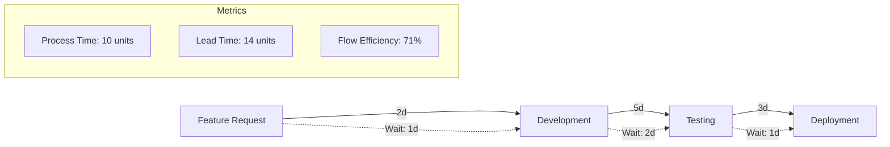

# Value Stream Map (VSM) Mermaid Generator

A web-based tool that simplifies the creation of Value Stream Maps using Mermaid diagram syntax. Features an intuitive interface, live preview capabilities, and automated flow efficiency calculations.

## ✨ Features

* **Interactive Web Interface**: Easy-to-use form for creating VSM diagrams step by step
* **Live Preview**: Visualize your diagrams in real-time with zoom and fullscreen support
* **PNG Export**: Save high-quality images of your diagrams directly from the preview
* **Mermaid Syntax Generation**: Automatically generates valid Mermaid code for your VSMs
* **Import/Export**: Load existing diagrams and save in multiple formats
* **Flow Metrics**: Automatic calculation of process time, lead time, and flow efficiency
* **Docker Deployment**: Consistent environment across all platforms
* **Zero Dependencies**: Pure client-side application, no backend required

## 🚀 Quick Start

1. **Run with Docker:**
   ```bash
   docker run -d -p 8080:8080 --name vsm-generator buckeye90/vsm-generator-app
   ```

2. **Access the Interface:**
   Open your browser and navigate to `http://localhost:8080`

3. **Create Your First Diagram:**
   - Add steps with process times
   - Include wait times between steps
   - Generate and preview your diagram
   - Export as Markdown or PNG

## 📁 Project Structure

```
vsm_mermaid_generator/
├── app/                    # Web application files
│   ├── index.html         # Main application (HTML/JS/CSS)
│   └── Dockerfile         # Container configuration
├── scripts/               # Automation scripts
│   ├── init_project.sh   # Project setup
│   ├── deploy.sh         # Build and run container
│   └── setup_test_env.sh # Test environment setup
├── tests/                 # Test suite
│   ├── test_vsm_generator.py    # Selenium UI tests
│   └── test_instructions.md     # Testing guide
├── docs/                  # Documentation
│   ├── preview_feature.md # Preview feature guide
│   └── ...               # Additional docs
└── diagrams/             # Sample diagrams
```

## 🎯 Key Features Explained

### Live Preview Mode
- **Real-time Rendering**: See your VSM diagram as it will appear
- **Interactive Controls**: Zoom (25%-400%), pan, and fullscreen
- **Screenshot Capture**: Save diagrams as PNG with one click
- **Keyboard Shortcuts**: Quick navigation with +/-/0/Esc keys

### Automated Calculations
- **Process Time**: Sum of all active work periods
- **Lead Time**: Total time from start to finish
- **Flow Efficiency**: Percentage of value-adding time

### Import/Export Options
- **Mermaid Code**: Copy to clipboard for use in documentation
- **Markdown Files**: Complete documents with embedded diagrams
- **PNG Images**: High-resolution exports for presentations

## 🛠️ Development Setup

1. **Clone the Repository:**
   ```bash
   git clone [repository-url]
   cd vsm_mermaid_generator
   ```

2. **Initialize Project Structure:**
   ```bash
   ./scripts/init_project.sh
   ```

3. **Deploy Locally:**
   ```bash
   ./scripts/deploy.sh
   ```

## 🧪 Running Tests

1. **Setup Test Environment:**
   ```bash
   ./scripts/setup_test_env.sh
   source .venv/bin/activate
   ```

2. **Configure Test Path:**
   Edit `tests/test_vsm_generator.py` and set `DOWNLOAD_DIR`

3. **Run Tests:**
   ```bash
   python tests/test_vsm_generator.py
   ```

## 📖 Documentation

- **[User Guide](instructions.md)**: Complete usage instructions
- **[Preview Feature](docs/preview_feature.md)**: Detailed preview functionality guide
- **[Container Usage](container_only_usage.md)**: Docker deployment options
- **[Testing Guide](tests/test_instructions.md)**: How to run and write tests
- **[API Documentation](docs/docs-index.md)**: Technical reference

## 🔧 Technologies Used

- **Frontend**: Vanilla JavaScript, Tailwind CSS
- **Visualization**: Mermaid.js for diagram rendering
- **Screenshot**: html2canvas for PNG export
- **Container**: Docker with Alpine Linux & Nginx
- **Testing**: Python, Selenium WebDriver
- **CI/CD Ready**: Automated testing and deployment scripts

## 🤝 Contributing

1. Fork the repository
2. Create a feature branch (`git checkout -b feature/amazing-feature`)
3. Commit your changes (`git commit -m 'Add amazing feature'`)
4. Push to the branch (`git push origin feature/amazing-feature`)
5. Open a Pull Request

### Development Guidelines
- Maintain zero external dependencies for the web app
- Follow existing code patterns and conventions
- Add tests for new features
- Update documentation as needed
- Ensure Docker compatibility

## 📄 License

This project is licensed under the MIT License - see the LICENSE file for details.

## 🙏 Acknowledgments

- Mermaid.js team for the excellent diagramming library
- Docker community for containerization best practices
- Contributors and testers who help improve this tool

## 📊 Example Output

Note: The process time of the final step in the VSM is displayed within the step's node label itself (e.g., `LastStepName (ProcessTime)`).


---

**Current Version**: 1.0.0  
**Last Updated**: November 2024  
**Status**: Active Development

For support or questions, please open an issue in the repository.