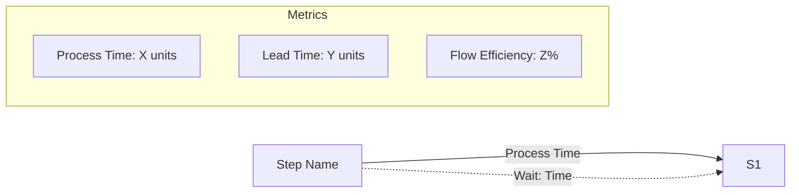

# Using the Value Stream Map (VSM) Mermaid Generator

This guide explains how to run and use the VSM Mermaid Generator application using its pre-built Docker container. This tool provides a simple web interface to help you create Value Stream Map diagrams using Mermaid syntax, with live preview capabilities.

## 1. Prerequisites

* **Docker:** You need Docker installed and running on your computer. If you don't have it, download and install Docker Desktop from the official Docker website: [https://www.docker.com/products/docker-desktop/](https://www.docker.com/products/docker-desktop/)
* **Terminal/Command Line:** You'll need a terminal or command prompt to run the Docker command.
    * **Windows:** Command Prompt, PowerShell, or Git Bash.
    * **macOS:** Terminal.
    * **Linux:** Any terminal application.
* **Modern Web Browser:** Chrome, Firefox, Safari, or Edge (for best preview feature compatibility)

## 2. Running the Container

1.  **Open your Terminal or Command Prompt.**
2.  **Choose a Version:** You can run the `latest` version or a specific version tag if available (e.g., `1.2.4`). Check Docker Hub ([https://hub.docker.com/r/buckeye90/vsm-generator-app/tags](https://hub.docker.com/r/buckeye90/vsm-generator-app/tags) - *assuming this is your repo*) for available tags.
3.  **Run the application:** Copy and paste the appropriate command into your terminal and press Enter:

    * **To run the `latest` version:**
        ```bash
        docker run -d -p 8080:8080 --name vsm-generator-container buckeye90/vsm-generator-app:latest
        ```
        *(You can often omit `:latest` as it's the default)*

    * **To run a specific version (e.g., `1.2.4`):**
        ```bash
        docker run -d -p 8080:8080 --name vsm-generator-container-1.2.4 buckeye90/vsm-generator-app:1.2.4
        ```
        *(Note: Using a different container name like `--name vsm-generator-container-1.2.4` is recommended if you might run multiple versions)*

4.  **Wait for Docker:** Docker will first check if the specified image tag exists locally. If not, it will download ("pull") it from Docker Hub. Once downloaded, it will start the container. This might take a moment the first time.

*What the command does:*
* `docker run`: Starts a new container.
* `-d`: Runs the container in the background.
* `-p 8080:8080`: Connects port 8080 on your computer to port 8080 inside the container. You can change the first `8080` if that port is busy on your machine (e.g., `-p 8081:8080`).
* `--name vsm-generator-container...`: Gives the container a memorable name.
* `buckeye90/vsm-generator-app:TAG`: The name and specific tag of the Docker image to use.

## 3. Accessing the Web Interface

1.  Once the container is running, open your web browser.
2.  Navigate to the address: `http://localhost:8080` (or the host port you specified, e.g., `http://localhost:8081`).
3.  You should see the "Value Stream Map Mermaid Generator" web page. Check the footer for the specific version built into the image.

## 4. Using the Interface

### Creating a Diagram

1.  **(Optional) Diagram Title:** Enter a title for your diagram. This will be used for file naming when saving.
2.  **Fill in the Steps:** 
    * For the first step, enter its name (e.g., "Feature Request") and its **Process Time** (e.g., "2 days"). Leave **Wait Time** blank for the first step.
    * Click "**Add Step at End**" to add subsequent steps.
    * For all steps after the first, enter the step name, its **Process Time**, and the **Wait Time** *before* this step begins (e.g., "5 days").
    * Use the blue **[+]** button next to any step to insert a new step before it.
    * Use the red **[×]** button to remove a step (available when you have more than one step).
3.  **Generate Code:** When all steps are entered, click "**Generate Mermaid Code**".

### Working with Generated Code

Once you've generated the Mermaid code, several options become available:

1.  **Copy Code:** Click the "**Copy Code**" button to copy the Mermaid syntax to your clipboard. You can paste this into any tool that supports Mermaid diagrams.

2.  **Save as Markdown:** Click "**Save as Markdown (.md)**" to download a complete Markdown file containing your diagram title and the Mermaid code block. This file will be saved to your browser's default download location.

3.  **Preview Diagram:** Click the "**Preview**" button to see a visual representation of your diagram:
    * The diagram will render in an interactive modal window
    * Use zoom controls to adjust the view (25% to 400% zoom)
    * Enter fullscreen mode for detailed examination
    * Save the diagram as a PNG image using the camera button
    * Close the preview with the X button or by pressing Esc

### Importing Existing Diagrams

1.  Click "**Load Diagram from Text**" to expand the import section.
2.  Paste your existing Mermaid code or Markdown content containing a Mermaid diagram.
3.  Click "**Parse and Load**" to import the diagram into the form.
4.  The steps will be populated automatically, ready for editing.
5.  Use "**Clear Text**" to empty the import area.

## 5. Preview Feature Details

The preview feature provides powerful visualization capabilities:

### Preview Controls
* **Zoom In [+]**: Increase diagram size (up to 400%)
* **Zoom Out [-]**: Decrease diagram size (down to 25%)
* **Reset Zoom [⊙]**: Return to 100% zoom
* **Fullscreen [⛶]**: Expand preview to full screen
* **Camera [📷]**: Save diagram as PNG image
* **Close [×]**: Exit preview mode

### Keyboard Shortcuts (when preview is open)
* `+` or `=`: Zoom in
* `-` or `_`: Zoom out
* `0`: Reset zoom
* `Esc`: Close preview

### Saving Diagrams as Images
When you click the camera button:
* The diagram is captured at high resolution (2x)
* File is saved with descriptive filename
* Format: `{DiagramTitle}_{Timestamp}.png`
* Downloads to your browser's default download folder

## 6. Understanding the Output

The generated Mermaid code includes:
* **Process Flow:** Shows steps connected by arrows with process times
* **Wait Times:** Dotted lines showing delays between steps
* **Metrics Box:** Displays calculated metrics:
  * **Process Time (PT):** Sum of all process times
  * **Lead Time (LT):** Total time including waits
  * **Flow Efficiency (FE):** Percentage of time spent in actual processing

Example output structure:


## 7. Stopping and Removing the Container

When finished, stop and optionally remove the container:

1.  **Open your Terminal or Command Prompt.**
2.  **Stop the container:**
    ```bash
    # Example for the 'latest' container name
    docker stop vsm-generator-container

    # Example for a specific version container name
    docker stop vsm-generator-container-1.2.4
    ```
3.  **(Optional) Remove the container:**
    ```bash
    # Example for the 'latest' container name
    docker rm vsm-generator-container

    # Example for a specific version container name
    docker rm vsm-generator-container-1.2.4
    ```

## 8. Troubleshooting

### General Issues
* **Cannot access `http://localhost:8080`:** 
  * Check Docker is running
  * Verify container is running: `docker ps`
  * Check port mapping is correct
  * Try a different port if 8080 is in use

* **`docker run` command fails:** 
  * Check image name and tag exist
  * Ensure Docker is running
  * Check network connectivity

### Preview Feature Issues
* **Preview won't open:**
  * Generate Mermaid code first
  * Check browser console for errors (F12)
  * Try refreshing the page

* **Diagram not rendering in preview:**
  * Verify Mermaid syntax is valid
  * Check for error messages in modal
  * Try regenerating the code

* **Screenshot not saving:**
  * Check browser download permissions
  * Ensure sufficient disk space
  * Try a different browser

* **Zoom controls unresponsive:**
  * Reset zoom to 100%
  * Close and reopen preview
  * Check browser zoom (Ctrl/Cmd + 0)

## 9. Tips and Best Practices

1. **Preview Before Export:** Always preview your diagram to ensure it looks correct before saving or sharing.
2. **Use Clear Step Names:** Descriptive step names make diagrams more readable.
3. **Consistent Time Units:** Use the same time unit throughout (days, hours, etc.) for clarity.
4. **Save Your Work:** Export diagrams regularly as both Markdown and PNG for different use cases.
5. **Fullscreen for Complexity:** Use fullscreen mode when working with large or complex diagrams.
6. **Zoom for Details:** Zoom in to examine specific parts of large diagrams.

## 10. Security and Privacy

* All processing happens in your browser - no data is sent to external servers
* The application runs in a sandboxed Docker container
* Mermaid rendering uses strict security settings to prevent code injection
* Your diagrams and data remain private and local

---

*For additional features and updates, check the project documentation.*  
*Last Updated: May 2025*