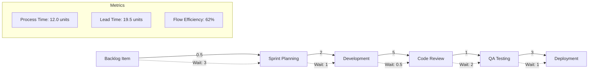

# Agile Feature Development

**Industry:** Software Development

**Description:** Complete feature lifecycle from backlog to production

## Value Stream Map

```mermaid
graph LR
    S0["Backlog Item"]
    S0 -->|0.5| S1
    S1["Sprint Planning"]
    S1 -->|2| S2
    S2["Development"]
    S2 -->|5| S3
    S3["Code Review"]
    S3 -->|1| S4
    S4["QA Testing"]
    S4 -->|3| S5
    S5["Deployment"]

    %% Add wait times
    S0 -.->|Wait: 3| S1
    S1 -.->|Wait: 1| S2
    S2 -.->|Wait: 0.5| S3
    S3 -.->|Wait: 2| S4
    S4 -.->|Wait: 1| S5

    %% Add process metrics
    subgraph Metrics
        PT[Process Time: 12.0 units]
        LT[Lead Time: 19.5 units]
        FE[Flow Efficiency: 62%]
    end
```
